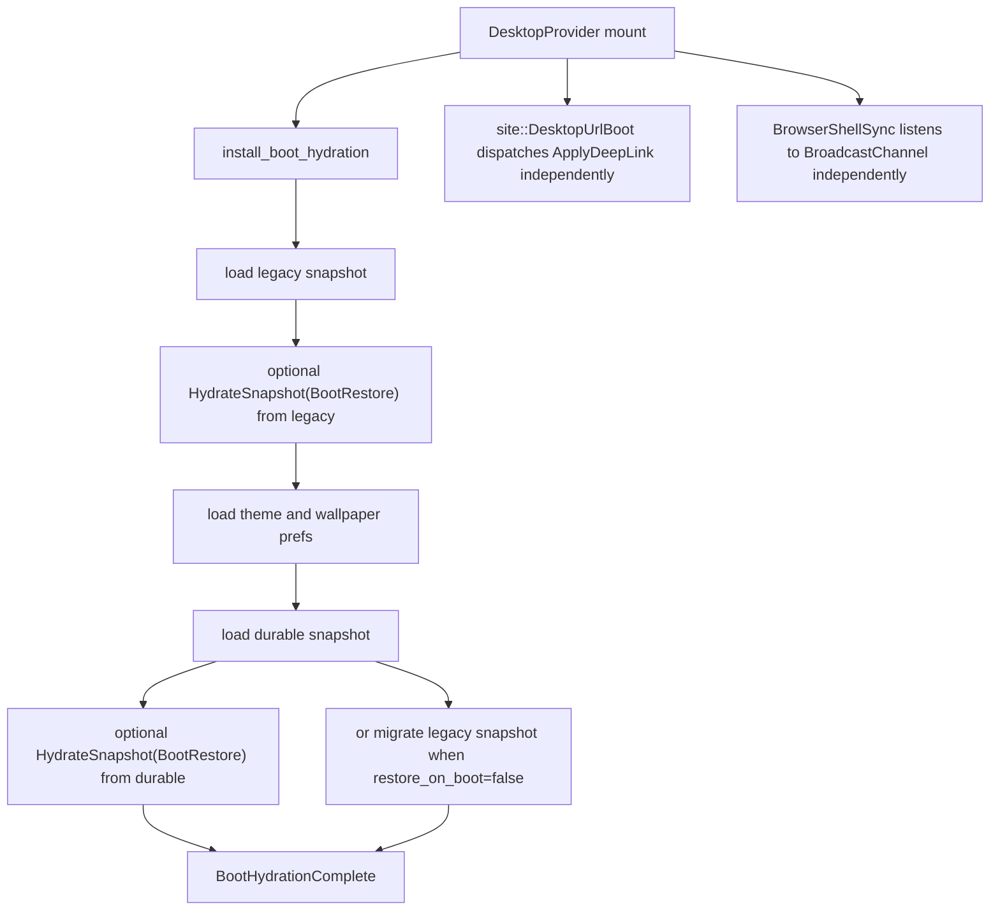

# Deterministic UI Shell Logic Audit

## Current Runtime Graph Before Remediation

## Defects

### UI-BOOT-01
- Files and symbols:
  - `ui/crates/desktop_runtime/src/host/boot.rs`
  - `install_boot_hydration`
- Root cause:
  Boot hydration loaded legacy and durable snapshots independently and dispatched both restore actions during one session.
- Pre-fix failure mode:
  A runtime session could restore the same layout twice, replay lifecycle twice, and race with later boot effects.
- Implemented correction:
  Replaced the multi-dispatch boot path with a typed `BootHydrationPlan` and a single reducer action, `CompleteBootHydration`, that resolves authority, migration, restore, and deep-link augmentation once.
- Residual risk:
  None in reducer-covered paths. Corrupt persisted payloads still fall back to safe non-restore behavior.

### UI-BOOT-02
- Files and symbols:
  - `ui/crates/desktop_runtime/src/host/boot.rs`
  - `ui/crates/desktop_runtime/src/persistence.rs`
  - `resolve_boot_hydration_plan`
  - `load_durable_boot_snapshot_record`
- Root cause:
  Durable precedence was only used for preference resolution. Legacy migration could be skipped or delayed depending on restore ordering.
- Pre-fix failure mode:
  Legacy-only state could avoid durable migration during restore-on-boot, and durable+legacy state could still hydrate legacy first.
- Implemented correction:
  Durable snapshot envelope is authoritative when present. Legacy snapshot is compatibility input only. Legacy-only state is migrated once before any authoritative hydrate and is still migrated when restore-on-boot is disabled.
- Residual risk:
  If durable save fails during legacy migration, the session still hydrates from the legacy snapshot once and logs the persistence failure.

### UI-DEEPLINK-01
- Files and symbols:
  - `ui/crates/site/src/web_app.rs`
  - `ui/crates/desktop_runtime/src/runtime_context.rs`
  - `ui/crates/desktop_runtime/src/reducer.rs`
  - `CompleteBootHydration`
  - `apply_deep_link_targets`
- Root cause:
  URL deep-link application ran in a separate browser effect with no boot gate and no merge semantics relative to restore state.
- Pre-fix failure mode:
  Async ordering could change whether a deep link opened a duplicate window, raced with restore, or was applied before boot completion.
- Implemented correction:
  The site entrypoint captures the initial URL intent and passes it into `DesktopProvider`. Boot hydration applies it inside the atomic reducer transition after restore using augment semantics and duplicate suppression.
- Residual risk:
  Live URL changes after initial mount still rely on the browser effect path, but the reducer now deduplicates satisfied targets and waits for `boot_hydrated`.

### UI-SYNC-01
- Files and symbols:
  - `ui/crates/platform_host_web/src/cross_context.rs`
  - `ui/crates/site/src/web_app.rs`
  - `ui/crates/desktop_runtime/src/host/persistence_effects.rs`
- Root cause:
  `BroadcastChannel` messages were raw strings with no sender identity or revision metadata.
- Pre-fix failure mode:
  Same-tab loops and stale-tab rehydrates could replay older theme, wallpaper, or layout state into a newer in-memory session.
- Implemented correction:
  Replaced string messages with typed `ShellSyncEvent { kind, sender_id, revision }`, added sender identity, added monotonic revision checks, and ignored sync messages until boot hydration completes.
- Residual risk:
  Theme and wallpaper revisions are host-generated monotonic values rather than durable envelope timestamps because those domains remain stored in typed prefs rather than durable app-state envelopes.

### UI-RESTORE-01
- Files and symbols:
  - `ui/crates/desktop_runtime/src/model.rs`
  - `DesktopState::from_snapshot`
- Root cause:
  Snapshot restore trusted persisted modal and focus state without rebuilding runtime invariants.
- Pre-fix failure mode:
  Orphaned modal children, ambiguous focus ownership, and stale next-window ids could survive restore.
- Implemented correction:
  Restore now recomputes focus, `active_modal`, `next_window_id`, and transient runtime-only fields. Orphaned modal children are dropped deterministically.
- Residual risk:
  Multi-modal corruption is normalized to a single active modal path rather than preserved exactly.

### UI-REDUCER-01
- Files and symbols:
  - `ui/crates/desktop_runtime/src/reducer.rs`
  - `CloseWindow`
  - `HydrateSnapshot`
  - `RecordAppliedRevision`
- Root cause:
  Transition safety around hydrate and close paths did not clear transient interaction state or reject stale revisions.
- Pre-fix failure mode:
  Closed windows could leave drag/resize state behind, and sync refresh could overwrite newer runtime state with older persisted snapshots.
- Implemented correction:
  Close and hydrate paths now clear transient interaction state. Sync hydration rejects non-newer revisions, and local persistence advances applied revisions before broadcasting.
- Residual risk:
  None observed in current tests.

## Patch Summary
- Added atomic boot completion and typed boot planning in `desktop_runtime`.
- Added durable snapshot revision loading and deterministic legacy migration.
- Moved deep-link application into the reducer with restore-aware duplicate suppression.
- Added revision-aware, sender-aware browser sync in `platform_host_web`.
- Rebuilt restore invariants in `DesktopState::from_snapshot`.
- Extended automated browser smoke coverage to Chromium, Firefox, and WebKit.

## Test Additions
- Boot planner tests for durable precedence, legacy migration with restore disabled, and single-pass legacy restore.
- Model tests for orphaned modal rejection and valid modal reconstruction.
- Reducer tests for stale sync rejection and deterministic boot deep-link augmentation.
- Cross-context tests for self-event ignore, stale-event ignore, and typed event round-trip.
